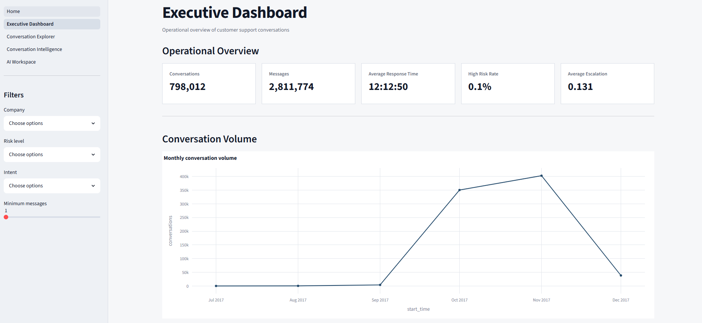
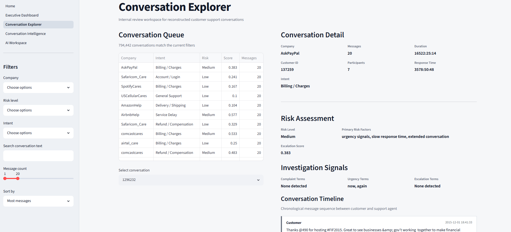
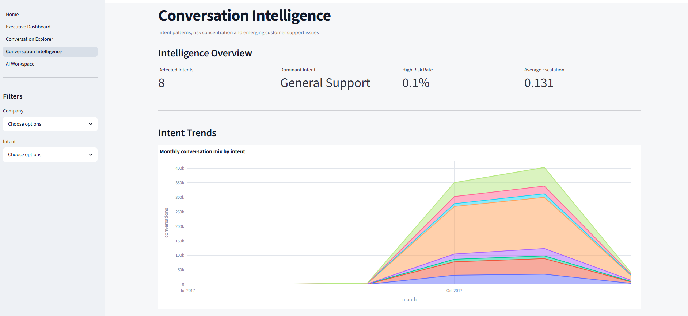
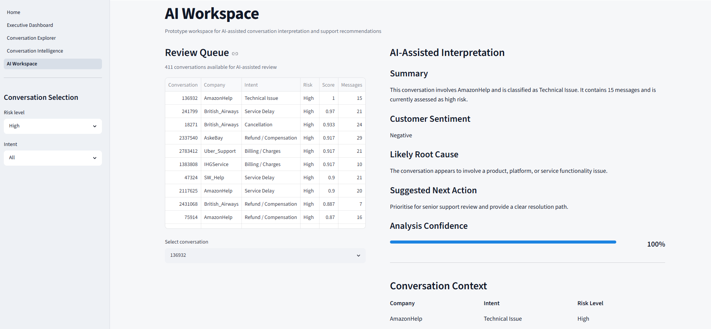

# ConvoLens

**Conversation Intelligence Platform for Customer Support Analytics**

ConvoLens is an end-to-end analytics platform that transforms large-scale customer support conversations into actionable business intelligence. The project combines data engineering, natural language processing, interactive dashboards and an AI-ready analysis layer to help organisations monitor operational performance, investigate customer issues and identify emerging support trends.

The application was developed as a portfolio project to demonstrate practical analytics engineering, dashboard development and software architecture using Python and Streamlit.

---

## Overview

Customer support teams generate thousands of conversations every day, but extracting meaningful insights from raw text remains challenging. ConvoLens reconstructs conversation threads, engineers analytical features and presents operational insights through four integrated workspaces.

The platform demonstrates how conversational data can support decision-making across operations, customer experience and management without relying on proprietary enterprise systems.

---

## Features

### Executive Dashboard


Monitor customer support operations through executive-level KPIs and trend analysis.

- Conversation volume trends
- Response performance
- Conversation length analysis
- Risk distribution
- Intent distribution
- Operational attention queue

---

### Conversation Explorer


Investigate individual customer conversations.

- Advanced filtering
- Conversation queue
- Chronological conversation timeline
- Investigation signals
- Risk assessment
- Metadata inspection

---

### Conversation Intelligence


Identify business-wide customer support patterns.

- Monthly intent trends
- Intent distribution
- Company × Intent heatmap
- Risk profile by intent
- Emerging issue analysis

---

### AI Workspace


Prototype AI-assisted support analysis.

- Conversation summary
- Sentiment estimation
- Root cause analysis
- Suggested next action
- Confidence score

The current implementation uses a local rule-based AI engine. The architecture has been intentionally designed so the analysis layer can later be replaced by an enterprise LLM without modifying the application interface.

---

## Architecture

```
Raw CSV
    │
    ▼
messages.parquet
    │
    ▼
conversations.parquet
    │
    ▼
conversations_scored.parquet
    │
    ▼
conversations_enriched.parquet
    │
    ├──────────────► analytics.parquet
    │
    ▼
Streamlit Application
```

---

## Project Structure

```
convolens/
│
├── app/
│   ├── Home.py
│   └── pages/
│
├── data/
│   ├── demo/
│   └── processed/
│
├── scripts/
│
├── src/
│   └── convolens/
│       ├── components/
│       ├── features/
│       ├── services/
│       ├── visualization/
│       └── utils/
│
└── assets/
```

---

## Technology Stack

| Category | Technologies |
|-----------|--------------|
| Language | Python |
| Framework | Streamlit |
| Data Processing | Pandas |
| Visualisation | Plotly |
| Storage | Apache Parquet |
| NLP | Rule-based Feature Engineering |
| AI Architecture | Modular Analysis Layer |
| Version Control | Git & GitHub |

---

## Running the Project

Clone the repository.

```bash
git clone https://github.com/your-username/convolens.git
```

Create a virtual environment.

```bash
python -m venv .venv
```

Activate the environment.

Windows

```bash
.venv\Scripts\activate
```

macOS / Linux

```bash
source .venv/bin/activate
```

Install dependencies.

```bash
pip install -r requirements.txt
```

Launch the application.

```bash
streamlit run app/Home.py
```

---

## Demo Dataset

The repository includes a curated demonstration dataset located in:

```
data/demo/
```

The application automatically loads the full processed dataset when available and falls back to the demo dataset when running from the public repository.

---

## AI Implementation

The AI Workspace currently uses a rule-based analysis engine located in:

```
src/convolens/features/ai_analysis.py
```

This layer has been intentionally isolated from the user interface so that it can be replaced by an enterprise language model such as Azure OpenAI, OpenAI, Gemini or Claude without modifying the dashboard pages.

No API keys or external AI services are required to run this portfolio version.

---

## Future Enhancements

Potential production enhancements include:

- Enterprise LLM integration
- Semantic conversation search
- Vector embeddings
- Topic modelling
- Real-time conversation ingestion
- Authentication and user management
- Cloud deployment
- Live operational monitoring

---

## Author

**Andrea Dang**

Master of Business Analytics — Deakin University

Data Analyst | Business Intelligence | Analytics Engineering